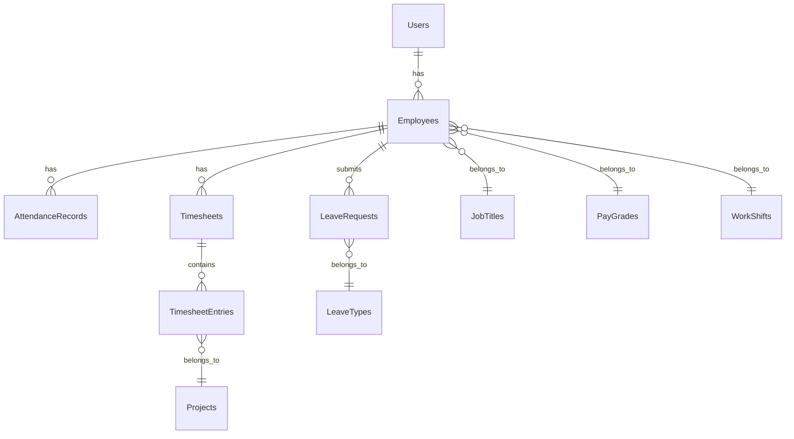

# TOAI HRM Suite - Knowledge Transfer Document

## Table of Contents
1. [Project Overview](#1-project-overview)
2. [System Architecture](#2-system-architecture)
3. [Technology Stack](#3-technology-stack)
4. [Repository and Access Details](#4-repository-and-access-details)
5. [Project Setup Guide](#5-project-setup-guide)
6. [Folder Structure Explanation](#6-folder-structure-explanation)
7. [Module-wise Functional Explanation](#7-module-wise-functional-explanation)
8. [API Documentation](#8-api-documentation)
9. [Database Structure](#9-database-structure)
10. [Deployment Process](#10-deployment-process)
11. [Logs and Monitoring](#11-logs-and-monitoring)
12. [Common Issues and Troubleshooting](#12-common-issues-and-troubleshooting)
13. [Maintenance Guide](#13-maintenance-guide)
14. [Security Considerations](#14-security-considerations)
15. [Third Party Integrations](#15-third-party-integrations)
16. [Known Limitations or Pending Tasks](#16-known-limitations-or-pending-tasks)
17. [Important Contacts](#17-important-contacts)
18. [Best Practices for Future Developers](#18-best-practices-for-future-developers)

---

## 1. Project Overview

### Project Name
TOAI HRM Suite - Professional Edition

### Project Type
Web Application - Human Resource Management System

### Business Objective
The TOAI HRM Suite is a comprehensive, enterprise-grade Human Resource Management System designed to streamline and automate HR processes for organizations of all sizes. The system provides a centralized platform for managing employee lifecycle, attendance, leave, performance, recruitment, and organizational administration.

### Problem Statement
Organizations face challenges in managing employee data, tracking attendance, processing leave requests, monitoring performance, and maintaining compliance. Traditional manual processes are time-consuming, error-prone, and lack real-time insights. This system addresses these challenges by providing an integrated, automated solution.

### Key Business Benefits
- **Efficiency**: Reduces administrative overhead by 60-80%
- **Compliance**: Ensures regulatory compliance through audit trails
- **Insights**: Provides real-time analytics and reporting
- **Employee Experience**: Self-service portal for employee empowerment
- **Scalability**: Supports organizational growth without system limitations

---

## 2. System Architecture

### Overall Architecture
The TOAI HRM Suite follows a **Model-View-Controller (MVC)** architecture pattern with a **3-tier** design:

```
┌─────────────────────────────────────────────────────────────┐
│                    Presentation Layer                       │
│  ┌─────────────────┐  ┌─────────────────┐  ┌──────────────┐ │
│  │   Frontend      │  │   Blade Views   │  │   Assets     │ │
│  │   (HTML/CSS/JS) │  │   (Templates)   │  │   (CSS/JS)   │ │
│  └─────────────────┘  └─────────────────┘  └──────────────┘ │
└─────────────────────────────────────────────────────────────┘
                              │
                              ▼
┌─────────────────────────────────────────────────────────────┐
│                    Application Layer                        │
│  ┌─────────────────┐  ┌─────────────────┐  ┌──────────────┐ │
│  │   Controllers   │  │   Middleware    │  │   Services   │ │
│  │   (Logic)       │  │   (Auth/Filter)│  │   (Business) │ │
│  └─────────────────┘  └─────────────────┘  └──────────────┘ │
└─────────────────────────────────────────────────────────────┘
                              │
                              ▼
┌─────────────────────────────────────────────────────────────┐
│                     Data Layer                              │
│  ┌─────────────────┐  ┌─────────────────┐  ┌──────────────┐ │
│  │   Models        │  │   Database      │  │   Cache      │ │
│  │   (Eloquent)    │  │   (MySQL)       │  │   (Redis)    │ │
│  └─────────────────┘  └─────────────────┘  └──────────────┘ │
└─────────────────────────────────────────────────────────────┘
```

### Frontend Architecture
- **Template Engine**: Blade (Laravel's templating system)
- **CSS Framework**: Tailwind CSS 4.x with custom lavender theme
- **JavaScript**: Vanilla JS with Axios for API calls
- **UI Components**: Reusable Blade components with PHP backing classes
- **Theme System**: Dynamic theming with CSS variables and localStorage persistence

### Backend Architecture
- **Framework**: Laravel 12 (PHP 8.2+)
- **Routing**: Resource-based routing with middleware protection
- **Controllers**: Feature-based controllers for each module
- **Middleware**: Custom authentication and authorization middleware
- **Services**: Business logic separation in service classes

### Database Architecture
- **Database Engine**: MySQL/MariaDB with utf8mb4 encoding
- **ORM**: Eloquent ORM with relationships and eager loading
- **Migrations**: Version-controlled schema management
- **Normalization**: 3NF normalized database design

### API Architecture
- **RESTful Design**: Standard REST conventions
- **Authentication**: Session-based authentication with CSRF protection
- **Response Format**: JSON responses with consistent structure
- **Error Handling**: Centralized exception handling

---

## 3. Technology Stack

### Backend Technologies

| Technology | Version | Purpose |
|------------|---------|---------|
| PHP | 8.2+ | Core backend language |
| Laravel | 12.x | Web framework |
| MySQL/MariaDB | 10.4+ | Primary database |
| Composer | Latest | Dependency management |
| PHPUnit | 11.5.3+ | Unit testing |

### Frontend Technologies

| Technology | Version | Purpose |
|------------|---------|---------|
| Tailwind CSS | 4.x | CSS framework |
| Vite | 7.0.7+ | Asset bundling |
| Axios | 1.11.0+ | HTTP client |
| Vanilla JavaScript | - | Frontend interactions |

### Development Tools

| Tool | Purpose |
|------|---------|
| Laravel Sail | Docker development environment |
| Laravel Pail | Real-time log monitoring |
| Laravel Pint | Code formatting |
| Git | Version control |
| XAMPP | Local development server |

### Supporting Technologies

| Technology | Purpose |
|------------|---------|
| Redis | Caching and session storage |
| SQLite | Development database (optional) |
| Mailhog | Email testing in development |

---

## 4. Repository and Access Details

### Git Repository
- **Repository Path**: `c:\xampp\htdocs\TOAI-HRM`
- **Remote Repository**: [Add Git URL here]
- **Branching Strategy**: Git Flow model

### Branching Strategy

| Branch | Purpose | Protection |
|--------|---------|------------|
| `main` | Production-ready code | Protected |
| `develop` | Integration branch | Protected |
| `feature/*` | Feature development | Open |
| `hotfix/*` | Production fixes | Protected |

### Required Tools

| Tool | Minimum Version | Installation |
|------|-----------------|--------------|
| PHP | 8.2 | XAMPP/Composer |
| Composer | 2.x | Global install |
| Node.js | 18.x | Official installer |
| npm | 9.x | Comes with Node.js |
| Git | 2.x | Git for Windows |
| MySQL | 10.4+ | XAMPP |

### Access Credentials
- **Database**: Configure in `.env` file
- **Mail Settings**: Configure in `.env` file
- **External APIs**: Configure in `.env` file

---

## 5. Project Setup Guide

### Prerequisites
1. **XAMPP** (or equivalent LAMP/WAMP stack)
2. **PHP 8.2+** with required extensions:
   - mbstring
   - openssl
   - pdo_mysql
   - tokenizer
   - xml
   - ctype
   - json
   - bcmath
3. **Composer** (dependency manager)
4. **Node.js 18.x+** and **npm**
5. **MySQL/MariaDB** database server
6. **Git** for version control

### Step-by-Step Installation

#### Step 1: Environment Setup
1. Install XAMPP with PHP 8.2+
2. Start Apache and MySQL services
3. Verify PHP installation:
   ```bash
   php --version
   ```
4. Verify Composer installation:
   ```bash
   composer --version
   ```

#### Step 2: Clone Repository
```bash
git clone [repository-url]
cd TOAI-HRM
```

#### Step 3: Install Dependencies
1. Install PHP dependencies:
   ```bash
   composer install
   ```
2. Install Node.js dependencies:
   ```bash
   npm install
   ```

#### Step 4: Environment Configuration
1. Copy environment file:
   ```bash
   copy .env.example .env
   ```
2. Generate application key:
   ```bash
   php artisan key:generate
   ```
3. Configure `.env` file:
   ```env
   APP_NAME="TOAI HRM Suite"
   APP_ENV=local
   APP_DEBUG=true
   APP_URL=http://localhost/toai-hrm
   
   DB_CONNECTION=mysql
   DB_HOST=127.0.0.1
   DB_PORT=3306
   DB_DATABASE=toai_hrm
   DB_USERNAME=root
   DB_PASSWORD=
   
   MAIL_MAILER=smtp
   MAIL_HOST=mailhog
   MAIL_PORT=1025
   MAIL_USERNAME=null
   MAIL_PASSWORD=null
   ```

#### Step 5: Database Setup
1. Create database:
   ```sql
   CREATE DATABASE toai_hrm CHARACTER SET utf8mb4 COLLATE utf8mb4_unicode_ci;
   ```
2. Run migrations:
   ```bash
   php artisan migrate
   ```
3. Seed database (optional):
   ```bash
   php artisan db:seed
   ```
4. Alternatively, import existing database:
   ```bash
   mysql -u root -p toai_hrm < database/toai_hrm.sql
   ```

#### Step 6: Build Assets
```bash
npm run build
```

#### Step 7: Start Development Server
```bash
php artisan serve
```

#### Step 8: Access Application
- **URL**: http://localhost:8000
- **Default Login**: Configure in database or use seeded credentials

### Development Workflow

#### Running Development Environment
```bash
# Start all services (recommended)
composer run dev

# Or start individually
php artisan serve
php artisan queue:listen
php artisan pail
npm run dev
```

#### Testing
```bash
# Run all tests
composer run test

# Run specific test
php artisan test --filter Feature/LoginTest
```

#### Code Quality
```bash
# Format code
./vendor/bin/pint

# Check code style
./vendor/bin/pint --test
```

---

## 6. Folder Structure Explanation

### Root Directory Structure

```
TOAI-HRM/
├── app/                    # Application core code
├── bootstrap/              # Framework bootstrapping files
├── config/                 # Configuration files
├── database/               # Database files (migrations, seeds)
├── public/                 # Public web root
├── resources/              # Frontend resources (views, assets)
├── routes/                 # Route definitions
├── storage/                # Application storage
├── tests/                  # Test files
├── vendor/                 # Composer dependencies
├── .env.example            # Environment template
├── composer.json           # PHP dependencies
├── package.json            # Node.js dependencies
└── artisan                 # CLI tool
```

### Application Core (`app/`)

```
app/
├── Components/             # Blade component classes
│   ├── Forms/             # Form components
│   ├── Layout/            # Layout components
│   └── UI/                # UI components
├── Http/                  # HTTP layer
│   ├── Controllers/       # Request handlers
│   │   ├── Admin/         # Admin module controllers
│   │   ├── Auth/          # Authentication controllers
│   │   └── [Module]/      # Feature controllers
│   └── Middleware/        # Request middleware
├── Models/                # Eloquent models
├── Services/              # Business logic services
└── Providers/             # Service providers
```

### Database (`database/`)

```
database/
├── migrations/            # Schema migrations
├── seeders/              # Database seeders
├── factories/            # Model factories
└── toai_hrm.sql          # Complete database dump
```

### Resources (`resources/`)

```
resources/
├── views/                # Blade templates
│   ├── components/       # Reusable components
│   ├── layouts/          # Page layouts
│   └── modules/          # Module-specific views
├── css/                  # Stylesheets
└── js/                   # JavaScript files
```

### Configuration (`config/`)

Key configuration files:
- `app.php` - Application settings
- `database.php` - Database connections
- `mail.php` - Mail configuration
- `session.php` - Session settings
- `filesystems.php` - File storage

---

## 7. Module-wise Functional Explanation

### 7.1 Authentication Module

**Purpose**: User authentication and session management

**Key Components**:
- Login/logout functionality
- Password reset system
- Session middleware
- CSRF protection

**Workflow**:
1. User submits credentials
2. Validation against database
3. Session creation
4. Redirect to dashboard

**Files**:
- `app/Http/Controllers/Auth/LoginController.php`
- `app/Http/Middleware/AuthSession.php`
- `resources/views/auth/`

### 7.2 Dashboard Module

**Purpose**: Central overview with analytics and quick actions

**Key Features**:
- Real-time statistics
- Interactive charts
- Quick action buttons
- Recent activity feed

**Key Components**:
- `DashboardController`
- Chart components
- Statistics services

### 7.3 Admin Module

**Purpose**: System administration and configuration

**Sub-modules**:
- **User Management**: Create, edit, delete users
- **Job Titles**: Manage position titles
- **Pay Grades**: Salary grade configuration
- **Work Shifts**: Shift scheduling
- **Organization**: Company structure
- **Qualifications**: Skills, education, licenses
- **Configuration**: System settings

**Key Controllers**:
- `AdminController`
- Various admin sub-controllers

### 7.4 PIM (Personal Information Management)

**Purpose**: Complete employee lifecycle management

**Features**:
- Employee records
- Personal details
- Job information
- Salary management
- Reporting structure

**Workflow**:
1. Add new employee
2. Configure personal details
3. Set job information
4. Assign salary and benefits
5. Manage reporting relationships

### 7.5 Leave Management

**Purpose**: Leave application and approval workflow

**Features**:
- Leave application
- Approval workflow
- Leave entitlements
- Leave types configuration
- Holiday management
- Leave reports

**Workflow**:
1. Employee applies for leave
2. Manager reviews and approves/rejects
3. System updates leave balance
4. Notifications sent

### 7.6 Time Tracking Module

**Purpose**: Attendance and timesheet management

**Features**:
- Punch in/out functionality
- Timesheet management
- Project time tracking
- Attendance reports
- Employee attendance records

**Key Components**:
- `TimeController`
- `AttendanceRecord` model
- `Timesheet` model
- `TimesheetEntry` model

### 7.7 Recruitment Module

**Purpose**: Candidate and vacancy management

**Features**:
- Job vacancy posting
- Candidate application tracking
- Interview scheduling
- Recruitment pipeline

### 7.8 Performance Management

**Purpose**: Employee performance evaluation

**Features**:
- Performance reviews
- KPI tracking
- Goal setting
- Review cycles

### 7.9 My Info Module

**Purpose**: Employee self-service portal

**Features**:
- Personal profile management
- Contact details update
- Emergency contacts
- Document upload
- Qualification management

### 7.10 Directory Module

**Purpose**: Employee directory and search

**Features**:
- Employee search
- Department filtering
- Contact information
- Organization chart view

### 7.11 Claim Management

**Purpose**: Expense claim processing

**Features**:
- Claim submission
- Approval workflow
- Expense categories
- Claim reports

### 7.12 Buzz Feed Module

**Purpose**: Internal communication and social features

**Features**:
- Company announcements
- Employee posts
- Social interactions
- File sharing

### 7.13 Maintenance Module

**Purpose**: System maintenance and data management

**Features**:
- Data purging utilities
- Access records
- System health checks
- Backup management

**Security**: Requires additional authentication layer

---

## 8. API Documentation

### Authentication Endpoints

| Method | Endpoint | Description | Auth Required |
|--------|----------|-------------|---------------|
| GET | `/login` | Show login form | No |
| POST | `/login` | Authenticate user | No |
| POST | `/logout` | Logout user | Yes |
| GET | `/password/forgot` | Show forgot password | No |
| POST | `/password/forgot` | Send reset link | No |

### Dashboard Endpoints

| Method | Endpoint | Description | Auth Required |
|--------|----------|-------------|---------------|
| GET | `/dashboard` | Dashboard view | Yes |

### Admin Endpoints

#### User Management
| Method | Endpoint | Description | Auth Required |
|--------|----------|-------------|---------------|
| GET | `/admin` | Admin dashboard | Yes |
| POST | `/admin/users` | Create user | Yes |
| POST | `/admin/users/{id}` | Update user | Yes |
| POST | `/admin/users/{id}/delete` | Delete user | Yes |
| POST | `/admin/users/bulk-delete` | Bulk delete users | Yes |

#### Job Titles
| Method | Endpoint | Description | Auth Required |
|--------|----------|-------------|---------------|
| GET | `/admin/job-titles` | List job titles | Yes |
| POST | `/admin/job-titles` | Create job title | Yes |
| POST | `/admin/job-titles/{id}` | Update job title | Yes |
| POST | `/admin/job-titles/{id}/delete` | Delete job title | Yes |

### Time Tracking Endpoints

| Method | Endpoint | Description | Auth Required |
|--------|----------|-------------|---------------|
| GET | `/time` | Time module dashboard | Yes |
| POST | `/time/attendance/punch-in` | Punch in | Yes |
| POST | `/time/attendance/punch-out` | Punch out | Yes |
| GET | `/time/attendance/my-records` | My attendance | Yes |
| POST | `/time/timesheets/entries` | Add timesheet entry | Yes |

### Leave Management Endpoints

| Method | Endpoint | Description | Auth Required |
|--------|----------|-------------|---------------|
| GET | `/leave` | Leave dashboard | Yes |
| POST | `/leave/apply` | Apply for leave | Yes |
| GET | `/leave/my-leave` | My leave requests | Yes |
| GET | `/leave/list` | All leave requests | Yes |

### Response Format

All API responses follow this structure:

```json
{
    "success": true,
    "data": {},
    "message": "Operation completed successfully",
    "errors": []
}
```

### Error Handling

- **400**: Bad Request - Validation errors
- **401**: Unauthorized - Not authenticated
- **403**: Forbidden - No permission
- **404**: Not Found - Resource doesn't exist
- **500**: Server Error - Internal server error

---

## 9. Database Structure

### Core Tables

#### Users Table
```sql
users
├── id (bigint, primary)
├── name (varchar, 255)
├── email (varchar, 255, unique)
├── email_verified_at (timestamp, nullable)
├── password (varchar, 255)
├── remember_token (varchar, 100, nullable)
├── created_at (timestamp)
├── updated_at (timestamp)
├── page_permissions (json, nullable)
└── deleted_at (timestamp, nullable)
```

#### Employees Table
```sql
employees
├── id (bigint, primary)
├── employee_id (varchar, 50, unique)
├── first_name (varchar, 100)
├── last_name (varchar, 100)
├── middle_name (varchar, 100, nullable)
├── nick_name (varchar, 100, nullable)
├── photo_path (varchar, 255, nullable)
├── employee_status (varchar, 50)
├── job_title_id (bigint, foreign key)
├── pay_grade_id (bigint, foreign key)
├── work_shift_id (bigint, foreign key)
├── employment_status (varchar, 50)
├── joined_date (date)
├── confirmation_date (date, nullable)
├── termination_date (date, nullable)
├── created_at (timestamp)
├── updated_at (timestamp)
└── deleted_at (timestamp, nullable)
```

#### Attendance Records Table
```sql
attendance_records
├── id (bigint, primary)
├── employee_id (bigint, foreign key)
├── date (date)
├── punch_in (datetime, nullable)
├── punch_out (datetime, nullable)
├── break_start (datetime, nullable)
├── break_end (datetime, nullable)
├── total_hours (decimal, 8,2, nullable)
├── overtime_hours (decimal, 8,2, nullable)
├── status (varchar, 50)
├── notes (text, nullable)
├── created_at (timestamp)
├── updated_at (timestamp)
└── deleted_at (timestamp, nullable)
```

#### Timesheets Table
```sql
timesheets
├── id (bigint, primary)
├── employee_id (bigint, foreign key)
├── period_start_date (date)
├── period_end_date (date)
├── status (varchar, 50)
├── total_hours (decimal, 8,2)
├── overtime_hours (decimal, 8,2)
├── submitted_at (timestamp, nullable)
├── approved_at (timestamp, nullable)
├── approved_by (bigint, foreign key, nullable)
├── notes (text, nullable)
├── created_at (timestamp)
├── updated_at (timestamp)
└── deleted_at (timestamp, nullable)
```

#### Timesheet Entries Table
```sql
timesheet_entries
├── id (bigint, primary)
├── timesheet_id (bigint, foreign key)
├── project_id (bigint, foreign key, nullable)
├── activity_date (date)
├── start_time (time)
├── end_time (time)
├── break_duration (decimal, 4,2)
├── hours_worked (decimal, 8,2)
├── description (text, nullable)
├── created_at (timestamp)
├── updated_at (timestamp)
└── deleted_at (timestamp, nullable)
```

### Supporting Tables

#### Job Titles
```sql
job_titles
├── id (bigint, primary)
├── title (varchar, 255)
├── description (text, nullable)
├── created_at (timestamp)
├── updated_at (timestamp)
└── deleted_at (timestamp, nullable)
```

#### Pay Grades
```sql
pay_grades
├── id (bigint, primary)
├── grade_name (varchar, 100)
├── min_salary (decimal, 10,2)
├── max_salary (decimal, 10,2)
├── created_at (timestamp)
├── updated_at (timestamp)
└── deleted_at (timestamp, nullable)
```

#### Work Shifts
```sql
work_shifts
├── id (bigint, primary)
├── shift_name (varchar, 100)
├── start_time (time)
├── end_time (time)
├── break_duration (decimal, 4,2)
├── created_at (timestamp)
├── updated_at (timestamp)
└── deleted_at (timestamp, nullable)
```

#### Leave Requests
```sql
leave_requests
├── id (bigint, primary)
├── employee_id (bigint, foreign key)
├── leave_type_id (bigint, foreign key)
├── start_date (date)
├── end_date (date)
├── days_requested (decimal, 4,2)
├── reason (text, nullable)
├── status (varchar, 50)
├── approved_by (bigint, foreign key, nullable)
├── approved_at (timestamp, nullable)
├── created_at (timestamp)
├── updated_at (timestamp)
└── deleted_at (timestamp, nullable)
```

### Database Relationships



### Database Indexes

Key indexes for performance:
- `users.email` (unique)
- `employees.employee_id` (unique)
- `attendance_records.employee_id_date` (composite)
- `timesheets.employee_id_period` (composite)
- `timesheet_entries.timesheet_id_date` (composite)

---

## 10. Deployment Process

### Development Deployment

#### Local Development Setup
1. **Environment Preparation**
   ```bash
   # Clone repository
   git clone [repository-url]
   cd TOAI-HRM
   
   # Install dependencies
   composer install
   npm install
   
   # Environment setup
   copy .env.example .env
   php artisan key:generate
   ```

2. **Database Setup**
   ```bash
   # Create database
   mysql -u root -p -e "CREATE DATABASE toai_hrm;"
   
   # Run migrations
   php artisan migrate
   
   # Seed data (optional)
   php artisan db:seed
   ```

3. **Asset Compilation**
   ```bash
   npm run build
   ```

4. **Start Development Server**
   ```bash
   php artisan serve
   ```

### Production Deployment

#### Server Requirements
- **PHP**: 8.2+ with required extensions
- **Web Server**: Apache 2.4+ or Nginx 1.18+
- **Database**: MySQL 8.0+ or MariaDB 10.4+
- **Memory**: Minimum 2GB RAM
- **Storage**: Minimum 20GB free space

#### Deployment Steps

1. **Server Setup**
   ```bash
   # Update system
   sudo apt update && sudo apt upgrade -y
   
   # Install required packages
   sudo apt install php8.2 php8.2-fpm php8.2-mysql php8.2-xml php8.2-mbstring php8.2-curl php8.2-zip php8.2-bcmath php8.2-gd php8.2-intl
   
   # Install Nginx
   sudo apt install nginx
   
   # Install MySQL
   sudo apt install mysql-server
   
   # Install Composer
   curl -sS https://getcomposer.org/installer | php
   sudo mv composer.phar /usr/local/bin/composer
   ```

2. **Application Deployment**
   ```bash
   # Clone repository
   sudo git clone [repository-url] /var/www/toai-hrm
   cd /var/www/toai-hrm
   
   # Set permissions
   sudo chown -R www-data:www-data /var/www/toai-hrm
   sudo chmod -R 755 /var/www/toai-hrm
   sudo chmod -R 777 /var/www/toai-hrm/storage
   sudo chmod -R 777 /var/www/toai-hrm/bootstrap/cache
   
   # Install dependencies
   composer install --optimize-autoloader --no-dev
   npm install
   npm run build
   
   # Environment setup
   sudo cp .env.example .env
   sudo php artisan key:generate
   ```

3. **Database Configuration**
   ```bash
   # Create database
   mysql -u root -p -e "CREATE DATABASE toai_hrm;"
   
   # Configure .env
   sudo nano .env
   # Update database credentials
   
   # Run migrations
   sudo php artisan migrate --force
   
   # Cache configuration
   sudo php artisan config:cache
   sudo php artisan route:cache
   sudo php artisan view:cache
   ```

4. **Web Server Configuration**

**Nginx Configuration** (`/etc/nginx/sites-available/toai-hrm`):
```nginx
server {
    listen 80;
    server_name your-domain.com;
    root /var/www/toai-hrm/public;
    index index.php index.html;

    location / {
        try_files $uri $uri/ /index.php?$query_string;
    }

    location ~ \.php$ {
        fastcgi_pass unix:/var/run/php/php8.2-fpm.sock;
        fastcgi_index index.php;
        fastcgi_param SCRIPT_FILENAME $realpath_root$fastcgi_script_name;
        include fastcgi_params;
    }

    location ~ /\.ht {
        deny all;
    }
}
```

5. **SSL Certificate Setup**
   ```bash
   # Install Certbot
   sudo apt install certbot python3-certbot-nginx
   
   # Obtain SSL certificate
   sudo certbot --nginx -d your-domain.com
   ```

6. **Scheduler Setup**
   ```bash
   # Add cron job
   sudo crontab -e
   
   # Add this line
   * * * * * cd /var/www/toai-hrm && php artisan schedule:run >> /dev/null 2>&1
   ```

### CI/CD Pipeline (Optional)

#### GitHub Actions Workflow
```yaml
name: Deploy to Production

on:
  push:
    branches: [ main ]

jobs:
  deploy:
    runs-on: ubuntu-latest
    
    steps:
    - uses: actions/checkout@v3
    
    - name: Setup PHP
      uses: shivammathur/setup-php@v2
      with:
        php-version: '8.2'
        
    - name: Install Dependencies
      run: composer install --no-dev
      
    - name: Build Assets
      run: npm install && npm run build
      
    - name: Deploy to Server
      uses: appleboy/ssh-action@v0.1.5
      with:
        host: ${{ secrets.HOST }}
        username: ${{ secrets.USERNAME }}
        key: ${{ secrets.SSH_KEY }}
        script: |
          cd /var/www/toai-hrm
          git pull origin main
          composer install --no-dev --optimize-autoloader
          npm install && npm run build
          php artisan migrate --force
          php artisan config:cache
          php artisan route:cache
          php artisan view:cache
```

---

## 11. Logs and Monitoring

### Logging Configuration

#### Log Channels
The system uses multiple log channels configured in `config/logging.php`:

```php
'channels' => [
    'stack' => [
        'driver' => 'stack',
        'channels' => ['single'],
        'ignore_exceptions' => false,
    ],
    
    'single' => [
        'driver' => 'single',
        'path' => storage_path('logs/laravel.log'),
        'level' => 'debug',
    ],
    
    'daily' => [
        'driver' => 'daily',
        'path' => storage_path('logs/laravel.log'),
        'level' => 'debug',
        'days' => 14,
    ],
],
```

#### Log Locations
- **Application Logs**: `storage/logs/laravel.log`
- **Error Logs**: `storage/logs/laravel-[date].log`
- **Activity Logs**: Database table `activity_logs`
- **Access Logs**: Web server access logs

### Real-time Monitoring

#### Laravel Pail
```bash
# Real-time log monitoring
php artisan pail

# Filter by specific log level
php artisan pail --level=error

# Filter by specific user
php artisan pail --filter="user_id:123"
```

#### Activity Logging
All user activities are logged in the `activity_logs` table:

```sql
-- Recent user activities
SELECT * FROM activity_logs 
WHERE created_at >= DATE_SUB(NOW(), INTERVAL 24 HOUR)
ORDER BY created_at DESC;

-- Activities by specific user
SELECT * FROM activity_logs 
WHERE user_id = 123 
ORDER BY created_at DESC;
```

### Performance Monitoring

#### Database Query Logging
Enable query logging in `.env`:
```env
DB_LOG_QUERIES=true
DB_SLOW_QUERY_THRESHOLD=1000
```

#### Memory Usage Monitoring
```bash
# Check current memory usage
php artisan tinker
>>> memory_get_usage(true);

# Monitor memory during operations
php artisan route:list --debug
```

### Error Tracking

#### Custom Error Handler
```php
// app/Exceptions/Handler.php
public function report(Throwable $exception)
{
    if ($this->shouldReport($exception)) {
        // Log to external service (Sentry, Bugsnag, etc.)
        // Send email notification for critical errors
    }
    
    parent::report($exception);
}
```

#### Health Checks
```bash
# Check application health
php artisan about

# Check database connection
php artisan db:show

# Check cache status
php artisan cache:clear
```

### Monitoring Dashboard

#### Key Metrics to Monitor
1. **Response Time**: Average page load time
2. **Error Rate**: 5xx errors per hour
3. **Database Performance**: Slow queries
4. **Memory Usage**: Peak memory consumption
5. **Disk Space**: Available storage
6. **Active Users**: Concurrent sessions

#### Alert Thresholds
- Response time > 2 seconds
- Error rate > 1%
- Memory usage > 80%
- Disk space < 10%
- Database connections > 80%

---

## 12. Common Issues and Troubleshooting

### 12.1 Installation Issues

#### Issue: Composer Install Fails
**Symptoms**: Memory limit errors or permission denied
**Solutions**:
```bash
# Increase memory limit
php -d memory_limit=2G /usr/local/bin/composer install

# Fix permissions
sudo chown -R $USER:$USER ~/.composer
chmod -R 755 ~/.composer
```

#### Issue: Database Connection Failed
**Symptoms**: SQLSTATE[HY000] [2002] Connection refused
**Solutions**:
1. Check MySQL service status:
   ```bash
   sudo systemctl status mysql
   sudo systemctl start mysql
   ```
2. Verify database credentials in `.env`
3. Check database exists:
   ```bash
   mysql -u root -p -e "SHOW DATABASES;"
   ```

#### Issue: Migration Fails
**Symptoms**: SQLSTATE[42S01]: Base table or view already exists
**Solutions**:
```bash
# Fresh migration (will delete all data)
php artisan migrate:fresh

# Rollback and re-migrate
php artisan migrate:rollback
php artisan migrate

# Check migration status
php artisan migrate:status
```

### 12.2 Performance Issues

#### Issue: Slow Page Loading
**Symptoms**: Pages taking > 3 seconds to load
**Solutions**:
1. Enable caching:
   ```bash
   php artisan config:cache
   php artisan route:cache
   php artisan view:cache
   ```
2. Optimize database queries:
   ```bash
   php artisan db:show
   ```
3. Check slow queries:
   ```sql
   SHOW VARIABLES LIKE 'slow_query_log';
   ```

#### Issue: High Memory Usage
**Symptoms**: PHP Fatal error: Allowed memory size exhausted
**Solutions**:
1. Increase memory limit in `.htaccess`:
   ```apache
   php_value memory_limit 512M
   ```
2. Optimize queries with eager loading:
   ```php
   // Bad - N+1 queries
   $users = User::all();
   foreach ($users as $user) {
       echo $user->profile->name;
   }
   
   // Good - Eager loading
   $users = User::with('profile')->get();
   ```

### 12.3 Authentication Issues

#### Issue: Login Redirect Loop
**Symptoms**: Infinite redirect after login
**Solutions**:
1. Clear session cache:
   ```bash
   php artisan session:table
   php artisan migrate
   php artisan cache:clear
   ```
2. Check middleware configuration:
   ```php
   // routes/web.php
   Route::middleware(['auth.session'])->group(function () {
       // Protected routes
   });
   ```

#### Issue: CSRF Token Mismatch
**Symptoms**: 419 Page Expired error
**Solutions**:
1. Clear cache:
   ```bash
   php artisan cache:clear
   php artisan config:clear
   ```
2. Check session configuration:
   ```env
   SESSION_DRIVER=database
   SESSION_LIFETIME=120
   ```

### 12.4 File Upload Issues

#### Issue: File Upload Fails
**Symptoms**: "The file could not be uploaded"
**Solutions**:
1. Check PHP upload settings:
   ```ini
   upload_max_filesize = 10M
   post_max_size = 10M
   max_execution_time = 300
   ```
2. Set directory permissions:
   ```bash
   chmod -R 755 storage/app/public
   chmod -R 755 storage/framework/cache
   ```

### 12.5 Email Issues

#### Issue: Emails Not Sending
**Symptoms**: No email notifications
**Solutions**:
1. Check mail configuration:
   ```env
   MAIL_MAILER=smtp
   MAIL_HOST=smtp.gmail.com
   MAIL_PORT=587
   MAIL_USERNAME=your-email@gmail.com
   MAIL_PASSWORD=your-app-password
   MAIL_ENCRYPTION=tls
   ```
2. Test mail configuration:
   ```bash
   php artisan make:mail TestMail
   php artisan tinker
   >>> Mail::to('test@example.com')->send(new TestMail());
   ```

### 12.6 Time Zone Issues

#### Issue: Incorrect Time Display
**Symptoms**: Wrong timestamps in database
**Solutions**:
1. Set timezone in `.env`:
   ```env
   APP_TIMEZONE=Asia/Kolkata
   ```
2. Update PHP timezone:
   ```ini
   date.timezone = "Asia/Kolkata"
   ```

### 12.7 Asset Issues

#### Issue: CSS/JS Not Loading
**Symptoms**: Broken styling and JavaScript
**Solutions**:
1. Rebuild assets:
   ```bash
   npm run build
   ```
2. Clear view cache:
   ```bash
   php artisan view:clear
   ```
3. Check asset paths:
   ```php
   // In blade templates
   {{ asset('css/app.css') }}
   {{ Vite::asset('resources/js/app.js') }}
   ```

---

## 13. Maintenance Guide

### 13.1 Daily Maintenance Tasks

#### Database Backups
```bash
# Daily backup script
#!/bin/bash
DATE=$(date +%Y%m%d)
mysqldump -u root -p toai_hrm > /backups/toai_hrm_$DATE.sql
find /backups -name "toai_hrm_*.sql" -mtime +7 -delete
```

#### Log Rotation
```bash
# Configure logrotate
sudo nano /etc/logrotate.d/toai-hrm

/var/www/toai-hrm/storage/logs/*.log {
    daily
    missingok
    rotate 14
    compress
    delaycompress
    notifempty
    create 644 www-data www-data
}
```

#### System Health Check
```bash
#!/bin/bash
# Health check script
echo "=== System Health Check ==="
echo "Disk Usage:"
df -h
echo "Memory Usage:"
free -h
echo "MySQL Status:"
systemctl is-active mysql
echo "Nginx Status:"
systemctl is-active nginx
```

### 13.2 Weekly Maintenance Tasks

#### Security Updates
```bash
# Update system packages
sudo apt update && sudo apt upgrade -y

# Update PHP dependencies
cd /var/www/toai-hrm
composer update --no-dev
npm update
```

#### Database Optimization
```bash
# Optimize tables
mysql -u root -p -e "OPTIMIZE TABLE toai_hrm.employees;"

# Check table status
mysql -u root -p -e "SHOW TABLE STATUS FROM toai_hrm;"
```

#### Cache Management
```bash
# Clear all caches
php artisan cache:clear
php artisan config:clear
php artisan route:clear
php artisan view:clear

# Rebuild caches
php artisan config:cache
php artisan route:cache
php artisan view:cache
```

### 13.3 Monthly Maintenance Tasks

#### Data Purging
```bash
# Purge old logs
php artisan activity:purge --days=90

# Purge soft-deleted records
php artisan model:prune --model=Employee --months=6
```

#### Performance Monitoring
```bash
# Generate performance report
php artisan performance:report

# Check slow queries
mysql -u root -p -e "SELECT * FROM mysql.slow_log ORDER BY start_time DESC LIMIT 10;"
```

#### Security Audit
```bash
# Check for vulnerabilities
composer audit

# Check file permissions
find /var/www/toai-hrm -type f -perm /o+w -ls
find /var/www/toai-hrm -type d -perm /o+w -ls
```

### 13.4 Quarterly Maintenance Tasks

#### Major Updates
```bash
# Laravel framework updates
composer update laravel/framework

# Review and update dependencies
composer outdated

# Security patches
composer audit --fix
```

#### Database Maintenance
```bash
# Full database backup
mysqldump -u root -p --all-databases > /backups/full_backup.sql

# Check database integrity
mysqlcheck -u root -p --check --databases toai_hrm
```

#### SSL Certificate Renewal
```bash
# Check SSL certificate status
sudo certbot certificates

# Renew certificates
sudo certbot renew
```

### 13.5 Automated Maintenance

#### Cron Jobs Setup
```bash
# Edit crontab
sudo crontab -e

# Add maintenance tasks
0 2 * * * /var/www/toai-hrm/scripts/daily_backup.sh
0 3 * * 0 /var/www/toai-hrm/scripts/weekly_maintenance.sh
0 4 1 * * /var/www/toai-hrm/scripts/monthly_maintenance.sh
* * * * * cd /var/www/toai-hrm && php artisan schedule:run >> /dev/null 2>&1
```

#### Laravel Scheduler Tasks
```php
// app/Console/Kernel.php
protected function schedule(Schedule $schedule)
{
    // Daily backup
    $schedule->command('backup:run')->dailyAt('02:00');
    
    // Purge old logs
    $schedule->command('log:clear --keep=14')->daily();
    
    // Send health report
    $schedule->command('health:check')->weekly();
    
    // Cache optimization
    $schedule->command('cache:prune')->daily();
}
```

---

## 14. Security Considerations

### 14.1 Authentication & Authorization

#### Session Management
- **Session Driver**: Database-based sessions for security
- **Session Lifetime**: 120 minutes (configurable)
- **Session Encryption**: All session data encrypted
- **CSRF Protection**: Enabled for all POST requests

#### Password Security
- **Hashing Algorithm**: Bcrypt with 12 rounds
- **Password Policy**: Minimum 8 characters, mixed case
- **Password Reset**: Secure token-based reset system
- **Rate Limiting**: Login attempts limited to prevent brute force

#### Access Control
- **Role-Based Access**: Different access levels for different user types
- **Page Permissions**: Granular permissions for specific pages
- **Middleware Protection**: All protected routes use auth middleware
- **API Rate Limiting**: Prevent API abuse

### 14.2 Data Protection

#### Input Validation
- **Server-Side Validation**: All inputs validated server-side
- **CSRF Tokens**: All forms include CSRF protection
- **XSS Protection**: Output escaping in Blade templates
- **SQL Injection Prevention**: Parameterized queries via Eloquent

#### File Upload Security
- **File Type Validation**: Only allowed file types accepted
- **File Size Limits**: Configurable upload size limits
- **Virus Scanning**: Optional virus scanning integration
- **Secure Storage**: Files stored outside web root

#### Data Encryption
- **Sensitive Data**: Encrypted at rest
- **Environment Variables**: Secure configuration storage
- **Database Encryption**: Optional field-level encryption
- **HTTPS Enforcement**: SSL/TLS required in production

### 14.3 Infrastructure Security

#### Web Server Configuration
```apache
# Security headers
Header always set X-Frame-Options DENY
Header always set X-Content-Type-Options nosniff
Header always set X-XSS-Protection "1; mode=block"
Header always set Strict-Transport-Security "max-age=31536000; includeSubDomains"

# Hide server information
ServerTokens Off
ServerSignature Off
```

#### File Permissions
```bash
# Secure file permissions
find /var/www/toai-hrm -type f -exec chmod 644 {} \;
find /var/www/toai-hrm -type d -exec chmod 755 {} \;
chmod -R 777 /var/www/toai-hrm/storage
chmod -R 777 /var/www/toai-hrm/bootstrap/cache
```

#### Database Security
- **User Privileges**: Limited database user permissions
- **Connection Encryption**: SSL for database connections
- **Backup Encryption**: Encrypted database backups
- **Audit Logging**: All database changes logged

### 14.4 Monitoring & Auditing

#### Security Monitoring
- **Failed Login Attempts**: Logged and monitored
- **Suspicious Activity**: Automated alerts for unusual patterns
- **Access Logs**: Complete audit trail maintained
- **Security Headers**: Regular security header validation

#### Vulnerability Management
```bash
# Regular security audits
composer audit

# Check for outdated packages
composer outdated

# Security scanning
php artisan security:scan
```

### 14.5 Compliance Considerations

#### GDPR Compliance
- **Data Minimization**: Only collect necessary data
- **Right to Erasure**: User data deletion capability
- **Data Portability**: Export user data on request
- **Consent Management**: Explicit consent for data processing

#### Data Retention
- **Automatic Cleanup**: Scheduled data purging
- **Archive Policy**: Long-term data archiving
- **Legal Holds**: Preserve data for legal requirements
- **Audit Trails**: Immutable audit logs

---

## 15. Third Party Integrations

### 15.1 Email Services

#### Configuration Options
```env
# SMTP Configuration
MAIL_MAILER=smtp
MAIL_HOST=smtp.gmail.com
MAIL_PORT=587
MAIL_USERNAME=your-email@gmail.com
MAIL_PASSWORD=your-app-password
MAIL_ENCRYPTION=tls

# MailHog (Development)
MAIL_MAILER=smtp
MAIL_HOST=127.0.0.1
MAIL_PORT=1025
MAIL_USERNAME=null
MAIL_PASSWORD=null
```

#### Email Templates
- **Welcome Emails**: New user registration
- **Password Reset**: Secure password reset links
- **Leave Notifications**: Leave request updates
- **System Alerts**: Critical system notifications

### 15.2 File Storage

#### Local Storage
```php
// Default configuration
'local' => [
    'driver' => 'local',
    'root' => storage_path('app'),
    'throw' => false,
],
```

#### Cloud Storage (Optional)
```env
# AWS S3 Configuration
AWS_ACCESS_KEY_ID=your-access-key
AWS_SECRET_ACCESS_KEY=your-secret-key
AWS_DEFAULT_REGION=us-east-1
AWS_BUCKET=your-bucket-name
```

### 15.3 Payment Gateways (Future Integration)

#### Planned Integrations
- **Stripe**: For payment processing
- **PayPal**: Alternative payment option
- **Razorpay**: Regional payment gateway

### 15.4 Analytics & Monitoring

#### Google Analytics (Optional)
```html
<!-- Add to layout header -->
<script async src="https://www.googletagmanager.com/gtag/js?id=GA_MEASUREMENT_ID"></script>
<script>
  window.dataLayer = window.dataLayer || [];
  function gtag(){dataLayer.push(arguments);}
  gtag('js', new Date());
  gtag('config', 'GA_MEASUREMENT_ID');
</script>
```

#### Error Tracking (Optional)
- **Sentry**: Error monitoring and tracking
- **Bugsnag**: Alternative error tracking
- **Rollbar**: Performance monitoring

### 15.5 API Integrations

#### Calendar Integration
- **Google Calendar**: Sync leave schedules
- **Outlook Calendar**: Microsoft integration
- **CalDAV**: Standard calendar protocol

#### Biometric Integration
- **Fingerprint Scanners**: Attendance integration
- **Face Recognition**: Advanced attendance
- **RFID Cards**: Card-based attendance

---

## 16. Known Limitations or Pending Tasks

### 16.1 Current Limitations

#### Technical Limitations
1. **Single Database**: Currently supports single database instance
2. **File Storage**: Limited to local storage (cloud storage pending)
3. **Real-time Features**: No WebSocket implementation yet
4. **Mobile App**: No native mobile application
5. **Multi-language**: Limited internationalization support

#### Functional Limitations
1. **Advanced Reporting**: Basic reporting only
2. **Workflow Automation**: Limited automation capabilities
3. **API Documentation**: No comprehensive API docs
4. **Performance Optimization**: Room for query optimization
5. **Testing Coverage**: Limited automated test coverage

### 16.2 Pending Features

#### High Priority
1. **Advanced Analytics Dashboard**
   - Customizable widgets
   - Real-time data updates
   - Export capabilities

2. **Mobile Responsive Improvements**
   - Better mobile experience
   - Progressive Web App (PWA)
   - Offline capabilities

3. **API Development**
   - RESTful API for mobile
   - API documentation
   - Rate limiting

#### Medium Priority
1. **Multi-tenant Support**
   - Multiple organizations
   - Data isolation
   - Custom branding

2. **Advanced Reporting**
   - Custom report builder
   - Scheduled reports
   - Data visualization

3. **Integration Hub**
   - Third-party integrations
   - Webhook support
   - API marketplace

#### Low Priority
1. **AI Features**
   - Predictive analytics
   - Chatbot support
   - Automated recommendations

2. **Advanced Security**
   - Two-factor authentication
   - Biometric login
   - Advanced audit trails

### 16.3 Technical Debt

#### Code Quality Issues
1. **Controller Bloat**: Some controllers are too large
2. **Duplicate Code**: Code duplication in some areas
3. **Missing Tests**: Insufficient test coverage
4. **Documentation**: Outdated code comments

#### Performance Issues
1. **N+1 Queries**: Some database queries need optimization
2. **Memory Usage**: High memory consumption in some operations
3. **Cache Strategy**: Inefficient caching implementation
4. **Asset Loading**: Unoptimized asset loading

### 16.4 Infrastructure Improvements

#### Scalability
1. **Load Balancing**: Single server limitation
2. **Database Scaling**: No read replicas
3. **CDN Integration**: No CDN implementation
4. **Auto-scaling**: No automatic scaling

#### Monitoring
1. **Advanced Monitoring**: Basic monitoring only
2. **Alert System**: Limited alerting capabilities
3. **Performance Metrics**: Insufficient metrics collection
4. **Health Checks**: Basic health checks only

---

## 17. Important Contacts

### 17.1 Development Team

| Role | Name | Contact | Responsibility |
|------|------|---------|----------------|
| Lead Developer | [Name] | [Email/Phone] | System architecture, core development |
| Backend Developer | [Name] | [Email/Phone] | API development, database management |
| Frontend Developer | [Name] | [Email/Phone] | UI/UX development, responsive design |
| QA Engineer | [Name] | [Email/Phone] | Testing, quality assurance |
| DevOps Engineer | [Name] | [Email/Phone] | Deployment, infrastructure |

### 17.2 Business Stakeholders

| Role | Name | Contact | Responsibility |
|------|------|---------|----------------|
| Project Manager | [Name] | [Email/Phone] | Project coordination, requirements |
| HR Manager | [Name] | [Email/Phone] | Business requirements, user feedback |
| System Administrator | [Name] | [Email/Phone] | Server management, security |
| Database Administrator | [Name] | [Email/Phone] | Database optimization, backups |

### 17.3 External Contacts

| Service | Contact | Purpose |
|---------|---------|---------|
| Hosting Provider | [Contact Info] | Server hosting, support |
| Domain Registrar | [Contact Info] | Domain management |
| SSL Provider | [Contact Info] | Certificate management |
| Email Service | [Contact Info] | Email delivery |

### 17.4 Emergency Contacts

| Issue | Contact | Response Time |
|-------|---------|---------------|
| System Down | [Phone Number] | 15 minutes |
| Security Breach | [Phone Number] | 5 minutes |
| Data Loss | [Phone Number] | 10 minutes |
| Performance Issues | [Phone Number] | 30 minutes |

---

## 18. Best Practices for Future Developers

### 18.1 Code Standards

#### PHP Coding Standards
- **PSR-12**: Follow PSR-12 coding standards
- **Documentation**: Document all classes and methods
- **Type Hints**: Use strict type declarations
- **Error Handling**: Proper exception handling

```php
<?php
// Example of good code practice
declare(strict_types=1);

namespace App\Http\Controllers;

use App\Models\User;
use Illuminate\Http\Request;
use Illuminate\Http\JsonResponse;

class UserController extends Controller
{
    /**
     * Get user profile.
     *
     * @param int $id
     * @return JsonResponse
     */
    public function profile(int $id): JsonResponse
    {
        try {
            $user = User::findOrFail($id);
            
            return response()->json([
                'success' => true,
                'data' => $user,
            ]);
        } catch (\Exception $e) {
            return response()->json([
                'success' => false,
                'message' => 'User not found',
            ], 404);
        }
    }
}
```

#### JavaScript Standards
- **ES6+**: Use modern JavaScript features
- **Async/Await**: Prefer async/await over callbacks
- **Error Handling**: Proper error handling in promises
- **Code Organization**: Modular code structure

```javascript
// Example of good JavaScript practice
class UserService {
    constructor(apiClient) {
        this.apiClient = apiClient;
    }

    async getUserProfile(userId) {
        try {
            const response = await this.apiClient.get(`/api/users/${userId}`);
            return response.data;
        } catch (error) {
            console.error('Failed to fetch user profile:', error);
            throw new Error('Unable to load user profile');
        }
    }
}
```

### 18.2 Database Best Practices

#### Query Optimization
```php
// Good: Eager loading
$users = User::with(['profile', 'department'])->get();

// Bad: N+1 queries
$users = User::all();
foreach ($users as $user) {
    echo $user->profile->name; // Separate query for each user
}

// Good: Specific columns
$users = User::select(['id', 'name', 'email'])->get();

// Good: Pagination
$users = User::paginate(25);
```

#### Migration Best Practices
```php
// Good: Reversible migrations
public function up()
{
    Schema::create('employees', function (Blueprint $table) {
        $table->id();
        $table->string('employee_id', 50)->unique();
        $table->string('first_name', 100);
        $table->string('last_name', 100);
        $table->timestamps();
        $table->softDeletes();
    });
}

public function down()
{
    Schema::dropIfExists('employees');
}
```

### 18.3 Security Best Practices

#### Input Validation
```php
// Good: Form request validation
public function store(StoreUserRequest $request)
{
    $validated = $request->validated();
    // Process validated data
}

// Good: Custom validation
$request->validate([
    'email' => 'required|email|unique:users',
    'password' => 'required|min:8|confirmed',
]);
```

#### Authentication & Authorization
```php
// Good: Policy-based authorization
public function update(User $user)
{
    $this->authorize('update', $user);
    // Update user
}

// Good: Middleware protection
Route::middleware(['auth', 'verified'])->group(function () {
    Route::get('/dashboard', [DashboardController::class, 'index']);
});
```

### 18.4 Performance Best Practices

#### Caching Strategies
```php
// Good: Query caching
$users = Cache::remember('active_users', 3600, function () {
    return User::where('active', true)->get();
});

// Good: Fragment caching
@cache('user_profile_'.$user->id, 3600)
    <div class="profile">
        {{ $user->name }}
    </div>
@endcache
```

#### Asset Optimization
```javascript
// Good: Lazy loading
const loadComponent = async () => {
    const module = await import('./components/HeavyComponent');
    module.default();
};

// Good: Code splitting
const routes = [
    {
        path: '/admin',
        component: () => import('./views/Admin.vue')
    }
];
```

### 18.5 Testing Best Practices

#### Unit Testing
```php
// Good: Feature test
class UserTest extends TestCase
{
    public function test_user_can_view_profile()
    {
        $user = User::factory()->create();
        
        $response = $this->actingAs($user)
            ->get('/profile');
            
        $response->assertStatus(200)
            ->assertSee($user->name);
    }
}
```

#### Database Testing
```php
// Good: Database transactions
public function test_user_creation()
{
    $this->beginTransaction();
    
    try {
        $user = User::factory()->create();
        $this->assertDatabaseHas('users', ['id' => $user->id]);
    } finally {
        $this->rollBack();
    }
}
```

### 18.6 Documentation Best Practices

#### Code Documentation
```php
/**
 * Calculate employee salary based on pay grade and experience.
 *
 * @param User $user The employee instance
 * @param float $experienceYears Years of experience
 * @return float Calculated salary
 * 
 * @throws InvalidArgumentException If experience is negative
 * 
 * @example
 * $salary = $this->calculateSalary($user, 5.5);
 */
public function calculateSalary(User $user, float $experienceYears): float
{
    if ($experienceYears < 0) {
        throw new InvalidArgumentException('Experience cannot be negative');
    }
    
    return $user->payGrade->base_salary * (1 + ($experienceYears * 0.05));
}
```

#### API Documentation
```php
/**
 * @OA\Get(
 *     path="/api/users/{id}",
 *     summary="Get user by ID",
 *     @OA\Parameter(
 *         name="id",
 *         in="path",
 *         required=true,
 *         @OA\Schema(type="integer")
 *     ),
 *     @OA\Response(
 *         response=200,
 *         description="Successful operation",
 *         @OA\JsonContent(ref="#/components/schemas/User")
 *     )
 * )
 */
```

### 18.7 Git Best Practices

#### Commit Messages
```
feat: Add user profile photo upload
fix: Resolve login redirect loop issue
docs: Update API documentation
style: Format code according to PSR-12
refactor: Extract user service class
test: Add unit tests for user service
chore: Update dependencies
```

#### Branch Naming
```
feature/user-profile-upload
bugfix/login-redirect-loop
hotfix/security-vulnerability
release/v1.2.0
```

### 18.8 Deployment Best Practices

#### Environment Management
```bash
# Production environment
APP_ENV=production
APP_DEBUG=false
APP_LOG_LEVEL=warning

# Development environment
APP_ENV=local
APP_DEBUG=true
APP_LOG_LEVEL=debug
```

#### Backup Strategy
```bash
# Automated backup script
#!/bin/bash
DATE=$(date +%Y%m%d_%H%M%S)
BACKUP_DIR="/backups"
APP_DIR="/var/www/toai-hrm"

# Database backup
mysqldump -u root -p toai_hrm > $BACKUP_DIR/db_backup_$DATE.sql

# Files backup
tar -czf $BACKUP_DIR/files_backup_$DATE.tar.gz $APP_DIR/storage/app

# Clean old backups (keep 30 days)
find $BACKUP_DIR -name "*.sql" -mtime +30 -delete
find $BACKUP_DIR -name "*.tar.gz" -mtime +30 -delete
```

---

## Conclusion

This Knowledge Transfer document provides comprehensive information about the TOAI HRM Suite, covering all aspects from system architecture to maintenance procedures. Future developers should use this document as their primary reference for understanding, maintaining, and extending the system.

### Key Takeaways
1. **System Architecture**: Laravel-based MVC architecture with MySQL database
2. **Security Focus**: Session-based authentication with comprehensive security measures
3. **Scalability**: Designed for growth with modular architecture
4. **Maintenance**: Regular maintenance schedule and automated processes
5. **Best Practices**: Follow coding standards and security guidelines

### Next Steps for New Developer
1. Read this document thoroughly
2. Set up local development environment
3. Review existing code and database structure
4. Run tests to understand system behavior
5. Start with small bug fixes or feature additions
6. Gradually take on more complex tasks

### Support Resources
- **Documentation**: This KT document, README.md, SYSTEM_DOCUMENTATION.md
- **Code Comments**: Inline documentation in source code
- **Team Contacts**: Contact information in Section 17
- **Version Control**: Git history for understanding changes

---
